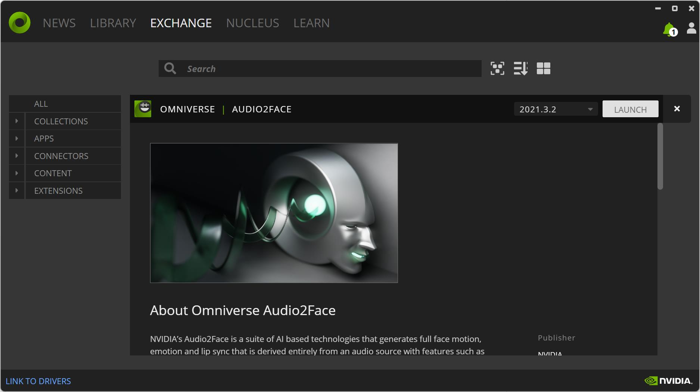
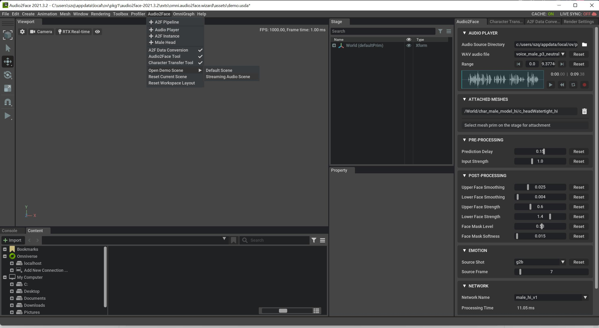
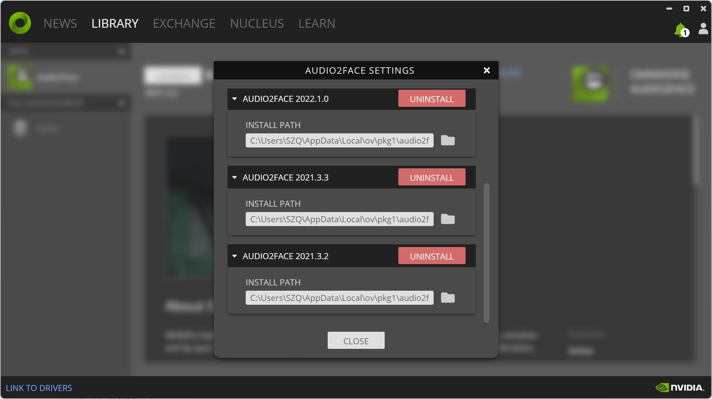

# Chatbot

We implemented the chatbot's three main functions: text, image, and voice. Deploy Textbot and Imagebot using Flask. Audiobot is based on NVIDIA Omniverse. 

## Deployment

**Text Version** 

As we have installed Flask, we create [app.py](app.py) file to generate routes for our web application, take input from HTML form and return response after processing chatbot. 

We add two features, text and image, in [chatbot.py](chatbot.py) file, and optimize [index.html](templates/index.html) to perform different actions based on different input conditions. 

The most important thing is that Flask loads the generated image saved under the [static](static/) folder. 

With all settled, we need to run the flask app using ``` python app.py ```. 

If everything goes right, go to – ``` http://localhost:5000/ ``` and enjoy chatbot.

**Audio Version** 

[Download](https://www.nvidia.com/en-us/omniverse/download/) Omniverse Laucher to install Audio2Face(2021.3.2) library. 



Launch the app and open a Demo Streaming Audio Scene where everything is already configured.



Keep the Audio2Face demo processing and open [audiobot.ipynb](audio2face/audiobot.ipynb) file through Omniverse Laucher settings. 



Execute codes and the Audiobot is ready to talk with you. 

This [video](https://www.youtube.com/watch?v=qKhPwdcOG_w&t=17s) could help you to better understand how to implement your client logic which pushes gRPC requests to the Streaming Audio Player server.
