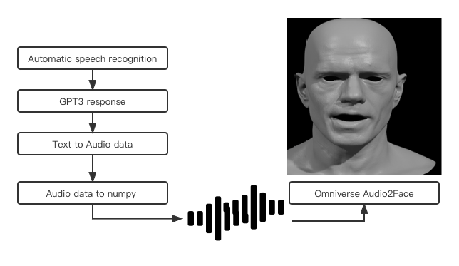

## Table of Contents
- [Introduction](#introduction)
- [Methodology](#methodology)
- [Deployment](#deployment)
- [Limitation](#limitation)
- [References](#references)

# Introduction

**1. Description**  
Through chatbot, people can communicate with virtual assistant. Through our chatbot, communication was not limited to textual conversation, but can be conducted with pictures and voices consider some vision impairments. In other words, we have implemented three basic functions in this project, text, image and vocie.  
First, we can text chat with chatbot and send basic daily life questions to chatbot and get very precise answers. This function is implemented by relying on the LSTM model in neural networks. The second function is that we send a descriptive text to chatbot and it will return a corresponding beautiful picture to us. This function is implemented by relying on the Wombo API. The third function is to communicate with the chatbot by voice, which is a virtual but realistic person generated by Audio2Face, an open sources software under NVIDIA. We can have a voice conversation with the chatbot, and it make response with auto lip-synic.

**2. Data**  
Text Dataset:  
https://www.kaggle.com/datasets/kausr25/chatterbotenglish  
https://www.kaggle.com/datasets/saurabhprajapat/chatbot-training-dataset 

# Methodology
**1. LSTM Model**  
To fills the slots and predicts the intent in the same time, we chose a sequence-to-sequence model using bidirectional LSTM network. Actually, the model is doing the same using an attention-based RNN.
Frist we reduce the redundant words if the answer has two or more of them desides removing stopwords. After cleaning data and appending <START> and <END> in all sequences, we tokenized using Word2Vec in gensim and paded the questions and answers using a single vocabulary. Using one-hot encoding answers.Trained a basic LSTM-based Seq2Seq model to predict decoder_target_data given encoder_input_data and decoder_input_data. Decode some sentences to check that the model is working (i.e. turn samples from encoder_input_data into corresponding samples from decoder_target_data).

<!--    -->
<!--   -->

</img>

Picture 1: NN model summary
  

**2. Picture Generator**  
Wombo, like many other apps that create generative art, is basically based on two artificial neural networks that work together to create the images, which are VQGAN and CLIP. VQGAN is a neural network used to generate images that look similar to other images. CLIP, on the other hand, is a neural network trained to determine how well a text description fits an image. CLIP provides feedback to VQGAN on how best to match the image to the text prompt. VQGAN adjusts the image accordingly and passes it back to CLIP to check how well it fits the text. This process is repeated a few hundred times, resulting in the ki-generated images. Since the model has already been well-pretrained by Wombo, so the best and easist way to do this is using Wombo API to utilize the model inside.  

<!--    -->

</img>

Picture 2: A cat looks like a dog"
   

**3. Speaking Version**  
To achieve Speaking Version chatbot, we need to clarify there are steps. Frist, with the help of the "Speech Recognition" API and "PyAudio" library, we built automatic speech recognition model to convert our speech to text. And then, text is passed into GPT3 model to get a quick response. After getting text response, we used gTTS library to generate audio file. In the end, audio file is converted to numpy type and feeded in Omniverse Audio2Face. Audio2Face is a combination of artificial intelligence (AI)-based technologies that derive facial motion and lip sync animations from an audio source. 

<!--   -->

</img>

Picture 3: Auido Communication Workflow
  

# Deployment

**1. Text Version** 
After saving our trained model, we used Flask to deploy our chatbot system locally. As we have installed Flask, we create app.py file to generate routes for our web application, take input from html form and return response after processing chatbot. We add two features, text and image, in chatbot.py file, and optimize index.html to perform different actions based on different input conditions. The most important thing is that Flask load the generated image saved under the static folder. With all settled, we need to just run the flask app using [python app.py]. If everything goes right, go to – http://localhost:5000/ and enjoy chatbot.

**2. Audio Version** 
Download Omniverse Laucher to install Audio2Face(2021.3.2) library. Open the app and a Demo Streaming Audio Scene where everything is already configured. Keep the Audio2Face demo processing and open audiobot.ipynb file through Omniverse Laucher settings. Execute codes and the Audiobot is ready to talk with you. This [video](https://www.youtube.com/watch?v=qKhPwdcOG_w&t=17s) could help you to better understand how to implement your client logic which pushes gRPC requests to the Streaming Audio Player server.

**3. GitHub Repository**
If you're eager to learn more about our bot and deploy it on your computer, you can find the complete code on the following GitHub repository: 
https://github.com/LZ497/chatbot

# Limitation

**Text Dataset:** We've trained the text model using only the basic 20 daily topics, and if it goes beyond the data set, the chatbot responds with related words instead of logical sentences. You could scale up the dataset or re-train our chatbot with specific fields conversation.

**Voice Recodnition:** AudioBot sometimes answer the question that may not the one you asked. It occurs when our automatic speech recognition model didn't convert your speech to text correctly due to accent, volume, and other human bias. 

**Audio2Face Library:** Omniverse has released a Streaming Audio Player feature since Audio2Face(2021.3.2) library to allow the streaming of audio data from external sources. However, our testing only succeeds in 2021.3.2 version and cannot be implemented in any later versions. This happens likely because Audio2Face require GeForce RTX 3070 or higher GPU, but our laptop has GeForce RTX 3050.

# References

https://studygyaan.com/python/create-web-based-chatbot-in-python-django-flask

https://github.com/metaiintw/build-an-avatar-with-ASR-TTS-Transformer-Omniverse-Audio2Face